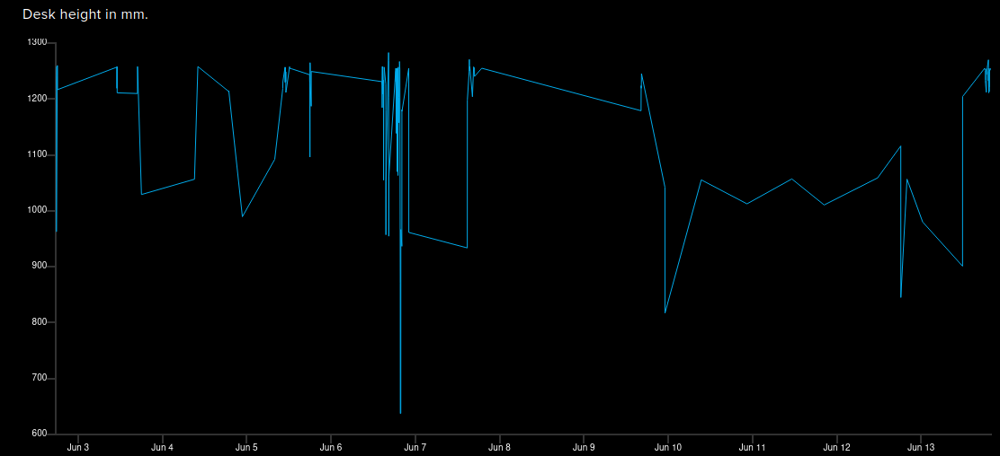
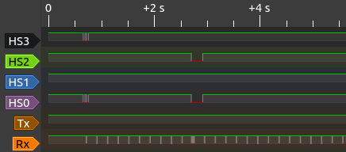

**Me:** Ok, Google. Stand up. 
**Google Assistant:**  Ok. Raising your Jarvis desk. 
**Desk:** _begins moving obediently_ 

### IoT Jarvis standup desk interface

**Notice:** This project probably will void your warranty.  Proceed at your own risk.

This is a project to add a computer interface to my [Jarvis stand-up desk from fully.com](https://www.fully.com/standing-desks/jarvis.html). 
I reverse-engineered the interface between the desk handset and the desk controller box
to find out how they communicate. Then I wired an ESP8266 wifi module (like the [Huzzah 
from Adafruit](https://www.adafruit.com/product/2471)) to a couple of RJ-45
jacks and plugged it all together.  Now I can snoop on the messages being sent between
the desk and the handset, inject my own messages to either one, and monitor the desk position
from the internet using the AdafruitIO MQTT dashboard interface.

It's pretty cool, but honestly, my motivation was to be able to lower the desk without getting
up to see the handset controller. The desk sits next to my couch at home. When I want to set
a drink on it while watching TV, it's inconvenient if I left it standing up.  "Ok, Google. Sit down"
The desk lowers, and I can put my drink down and continue watching Netflix. To be fair, I didn't need to
decode the serial interface for this because the buttons used for memory presets are sent on separate
signal lines. The serial protocol decoding was just for fun.

As a useless side-benefit, you can look back at my [desk's height history](https://io.adafruit.com/phord/feeds/jarvis.height) and see every time it moved up or down and [what preset was used](https://io.adafruit.com/phord/feeds/jarvis.preset).
And I can control my desk from anywhere on the internet, so I can lower it even if I'm not home, though that
seems like a bad idea.

Features so far:
* Reverse engineered the UART interface and most control messages
* Snoop on the messages being sent between the desk and the handset
* Read the handset buttons
* Telnet wifi interface for debug logging
* Simulate handset buttons (e.g. press 3)
* Monitor desk configuration
* Connected the desk to AdafruitIO's MQTT dashboard for monitoring
* Can control the desk position via the AdafruitIO dashboard
* Interfaced IFTTT to the AdafruitIO feed controlling my desk
* Added a Google Assistant command phrase to raise and lower my desk

Future things:
* Inject control messages to the UART to control and configure the desk
* Inject control messages to the UART to control the handset display
* Explore the handset to see what else it might be hiding
* Keep the handset display awake so buttons are always visible[1]
* Explore the _other_ UART control protocol the desk sometimes falls into
* Expose all handset controls so people can add memory presets to their cheap-model handsets.
* Expand the telnet interface to permit different log levels, message injection, etc.

[1] Sadly, you can't display random text on your display module, as far as I know.
But you could make a nice little 3-digit clock or something there, if you wanted.

### Technical notes

The Jarvis desk handset style I have is the touchpanel interface with memories.  You can surely use
the desk without this interface if you design your own, but you need to know the protocols.  I
will try to publish what I discovered through reverse-engineering here.

* Handset model: JCHT35M16-1
* Desk controller model: FullyCB2C-A

## Physical interface

The interface from the handset to the controller is via an RJ-45 8-pin connector (like an ethernet
connector). The pins in the RJ-45 jack are numbered 1 to 8.

_Note: I don't know any official names for these signal lines, so I made these up myself._
_Any mistakes here about the meaning or use of these lines are mine._

Following are their usage on the desk:

| Pin | Label | Description
| --- | ----- | --------------------------------------
|  1  |  HS3  | Handset control line 3 [1]
|  2  |  Tx   | Serial control messages from controller to handset [2]
|  3  |  GND  | Ground
|  4  |  Rx   | Serial control messages from handset to controller [2]
|  5  |  GND  | Vcc (5vdc) supply from desk controller [3]
|  6  |  HS2  | Handset control line 2 [1]
|  7  |  HS1  | Handset control line 1 [1]
|  8  |  HS0  | Handset control line 0 [1]

[1] The pins (HS0, HS1, HS2, HS3) make up the "button-press" mux lines. See _HSx control lines_ below 
[2] Serial port UART is 9600bps, 8 data bits, No parity, 1 stop bit 
[3] 5VDC supply appears capable of driving at least 300ma 
[4] All the signal lines have 5v pullups provided by the desk controller

_In this capture, I pressed "Memory" to wake the screen up, and then 3 to move the desk to position 3._

## HSx control lines

The desk provides 5v pullups on all these signal lines. A mark is signaled by pulling the line low.

On the mechanical desk control buttons, when you press the up button, one of these lines is
pulled low.  Similarly when you press the down button, another line is pulled low.  When you
use a smart controller interface like the touch-screen model, multiple lines may be pulled
low simultaneously to indicate up to 7 different buttons.  If you combine the first three
lines' inverted logical signals, you will find a "button number" between 0 and 7 is possible.

Note: HS3 seems to be a special line used only for Memory Button signaling.

Zero means no button is being pressed.  This is "open".

         Down  Up  1  2  3  4  M
    HS3                        X
    HS2               X  X  X
    HS1         X  X        X
    HS0    X       X     X     X

Translated into binary, these buttons send these codes:
| Button | Value | Notes
| ------ | ----- | ------
| "Open" |   0   |
| Down   |   1   |
| Up     |   2   |
| 1      |   3   |
| 2      |   4   |
| 3      |   5   |
| 4      |   6   |
| M      |   9   |  (always sent as two 30ms pulses)

## UART control lines

The Jarvis UART signaling protocol sends checksummed control packets consisting of between 6
and 9 bytes. All data is sent using 9600 bps, 8 data bits, no parity (9600/8N1). Desk controller
sends data on Tx, handset sends data on Rx.  Command packets are the same format on both.

| Field    | Octets  | Description
| -------- | ------- | ---------------------------------
| ADDRESS  |      2  | Same value in both bytes; 0xF1 for Handset, 0xF2 for controller
| COMMAND  |      1  | See *KNOWN COMMANDS*
| LENGTH   |      1  | Length of PARAMS bytes that follow (0 to 3 (??))
| PARAMS   | LENGTH  | Omitted if LENGTH=0
| CHECKSUM |      1  | 8-bit sum of {COMMAND, LENGTH, PARAMS}
| EOM 0x7E |      1  | End of message (0x7E)

The address byte is repeated two times.  The desk controller always sends 0xF2 0xF2.
The handset always sends 0xF1 0xF1.

The PARAMS field consists of 0 to 3 bytes.  I haven't decoded all the meaning here. WIP

The checksum is the low-byte sum of the all the payload bytes.  In pseudocode,

     CHECKSUM = sum(COMMAND, LENGTH, PARAMS) % 0xFF

The EOM byte is always 0x7E.

I will use a shorthand to refer to these packets later. The desk controller packets will be
given as CONTROLLER(COMMAND, PARAMS, ...) and the handset packets will be given as
HANDSET(COMMAND, PARAMS...).  PARAMS are given as P0 for the first byte, P1 for the second,
etc.  16-bit params are indicated like {P0,P1}. Optional params are shown in brackets.

## Startup sequence

Smart handset sends a NULL (0x00) byte on first startup.  If no response is received from the
desk controller, it sends a 230ms BREAK signal followed by another 0x00 byte. If still no
response is received, it begins sending HANDSET(0x29) repeatedly.

       [addr] [addr] [cmd] [length] [params] [chksum] [EOM]

        field  size   description
        addr      1   Sent twice at start of each message.
                      0xF2 for desk controller; 0xF1 for Handset
        cmd       1   See "Known Commands"
        length    1   Count of bytes in [params], 0..3
        params 0..3   Parameter bytes for cmd
        chksum    1   Simple checksum of [cmd, length, params]
        EOM       1   0x7E

## Known Commands

_Note: I don't know any official names for these commands, so I made these up myself._
_Any mistakes here about the command usage or meaning are mine._
_All transmitted byte values are given in hex._

| Name      | CMD  | Desk/HS | Params | Description
| --------- | ---- | ------- | ------ | ----------------------------------------
| HEIGHT    |  01  |   D     |    3   | Height report; P0=4 (mm?)
|           |      |         |        |   {P0,P1} = height in mm or tenths of inches
|           |      |         |        |   P2 = ??? (0x7 or 0xF seen so far)  Not units
|           |      |         |        |   Height from 240..530 is in inches
|           |      |         |        |   Height from 650..1290 is in mm
|           |      |         |        |
| PROGMEM\_1 |  03  |   H     |    0   | Set memory position 1 to current height
| PROGMEM\_2 |  04  |   H     |    0   | Set memory position 2 to current height
| PROGMEM\_3 |  25  |   H     |    0   | Set memory position 3 to current height
| PROGMEM\_4 |  26  |   H     |    0   | Set memory position 4 to current height
|           |      |         |        |
| UNITS     |  0E  |   H     |    1   | Set units to cm/inches
|           |      |         |        |   P0=0x00  Set units to CM
|           |      |         |        |   P0=0x01  Set units to IN
|           |      |         |        |
| MEM\_MODE  |  19  |   H     |    1   | Set memory mode
|           |      |         |        |   P0=0x00  One-touch mode
|           |      |         |        |   P0=0x01  Constant touch mode
|           |      |         |        |
| COLL\_SENS |  1D  |   H     |    1   | Set anti-collision sensitivity  (Sent 1x; no repeats)
|           |      |         |        |   P0=0x01  High
|           |      |         |        |   P0=0x02  Medium
|           |      |         |        |   P0=0x03  Low
|           |      |         |        |
| LIMIT\_RESP|  20  |   D     |    1   | Max-height set/cleared; response to [21];
|           |      |         |        |   P0=0x00  "Min/max cleared"
|           |      |         |        |   P0=0x01  "Max-height set"
|           |      |         |        |   P0=0x10  "Min-height set"
|           |      |         |        |
| SET\_MAX   |  21  |   H     |    0   | Set max height; Sets max-height to current height
|           |  21  |   D     |    2   | Report max-height; [P0,P1] = max-height
|           |      |         |        |   Q: Can we set max-height by giving params?
|           |      |         |        |
| SET\_MIN   |  22  |   H     |    0   | Set min height; Sets min-height to current height
|           |  22  |   D     |    2   | Report min-height; [P0,P1] = min-height
|           |      |         |        |
| LIMIT\_CLR |  23  |   H     |    1   | Clear min/max height
|           |      |         |        |   P0=0x01  Max-height cleared
|           |      |         |        |   P0=0x02  Min-height cleared
|           |      |         |        |
| LIMIT\_STOP|  23  |   D     |    1   | Min/Max reached
|           |      |         |        |   P0=0x01  "Max-height reached"
|           |      |         |        |   P0=0x02  "Min-height reached"
|           |      |         |        |
| WAKE      |  29  |   H     |    0   | Poll message sent when desk doesn't respond to BREAK messages
|           |      |         |        |
| RESET     |  40  |   D     |    0   | Indicates desk in RESET mode; Displays "RESET"
|           |      |         |        |
| CALIBRATE |  91  |   H     |    0   | Height calibration (Repeats 2x)
|           |      |         |        |   Desk must be at lowest position
|           |      |         |        |   Desk enters RESET mode after this
|           |      |         |        |
| REP\_PRESET|  92  |   D     |    1   | Moving to Preset location
|           |      |         |        |   P0=[4,8,10,20] mapping to presets [1,2,3,4]

## Height report

The desk controller responds to the handset by sending a display message containing the current
desk height. It sends this several dozen times while the display is on.  The height is encoded
as a two-byte word (HI, LOW) which make up the desk's height.  The units are in millimeters
tenths of inches depending on the configuration UNITS setting. The packet looks like this:

     CONTROLLER(0x01, HI, LOW, 0x07)

For example, to indicate 128.6cm (1286mm), the desk sends CONTROLLER(0x01, 0x05, 0x06, 0x07),
because 0x0506 = 1286 in decimal.  I don't know what the third parameter is here (0x07).  Sometimes
it's 0x0F.  More experimenting needed.

## Memory setting

Memories are programmed by sending one of the PROGMEM\_\* commands to the controller.  Each
command takes no parameters but sets the memory to the current height of the desk.

The desk does not acknowledge the setting.

## Preset buttons

When a Preset button is pressed (not in a programming mode) the lines HS0..HS3 are signaled as
shown above in *HSx control lines*. Notice that the binary pattern flagged in those pins maps
1 to 0x03, 2 to 0x04, 3 to 0x05 and 4 to 0x06.

The command codes to set these presets are mapped similarly:
    PROGMEM\_1 = 0x03, PROGMEM\_2 = 0x04, PROGMEM\_3 = 0x25 and PROGMEM\_4 = 0x26.

Why not the same?  Is it because 3&4 were added on later, but commands 0x05/0x06 were taken?

## Configuration commands

See the table above for the short version.  Each command may or may not be sent multiple times and 
have a different stream of responses from the other side.  I'll try to document my findings about
these anomalies here later.
